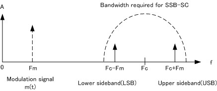
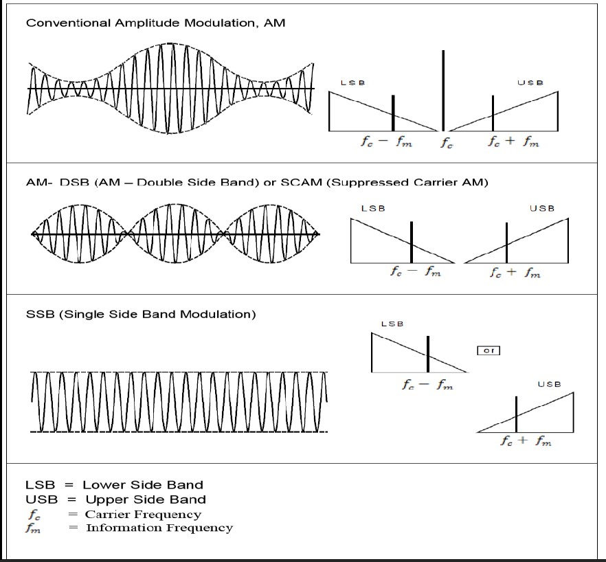

## Storyboard (Round 2)

Experiment 1: DSB/SSB amplitude modulation

### 1. Story Outline:

The experiment is based on DSB-SC which is a double sideband suppressed carrier modulation and SSB-SC is single sideband suppressed carrier modulation.
When amplitude modulation is carried out, the modulating signal spectrum is shifted to the carrier frequency band. DSB-SC is so named because the modulating signal extends symmetrically on both sides of the carrier wave. SSB-SC is DSB-SC with only one side band.

The objective of the experiment is to study DSB/SSB amplitude modulation and determine its modulation factor.
### 2. Story:

"My Computer" gives us an overview about different types of drives present in the computer. The My Computer folder is a gateway to all the data stored on the computer, attached devices, and the network -- as well as a shortcut to most of your system information.

 

A computer system consists of mainly four basic units; namely input unit, storage unit, central processing unit and output unit. Central Processing unit further includes Arithmetic logic unit and control unit, as shown in the figure:. A computer performs five major operations or functions irrespective of its size and make. These are

• it accepts data or instructions as input,

• it stores data and instruction

• it processes data as per the instructions,

• it controls all operations inside a computer, and

• it gives results in the form of output.
 

### .Conclusion:
####  After going thoroughly to the basics of computer students can easily identify the parts of the computer.

